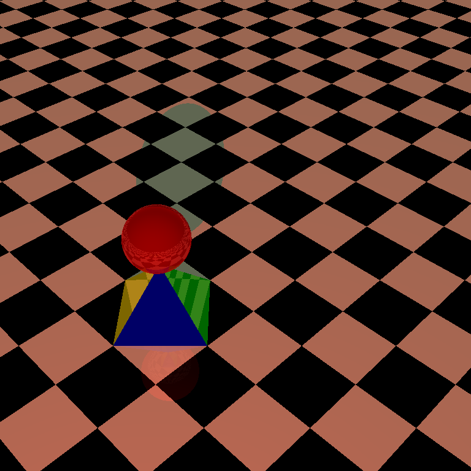
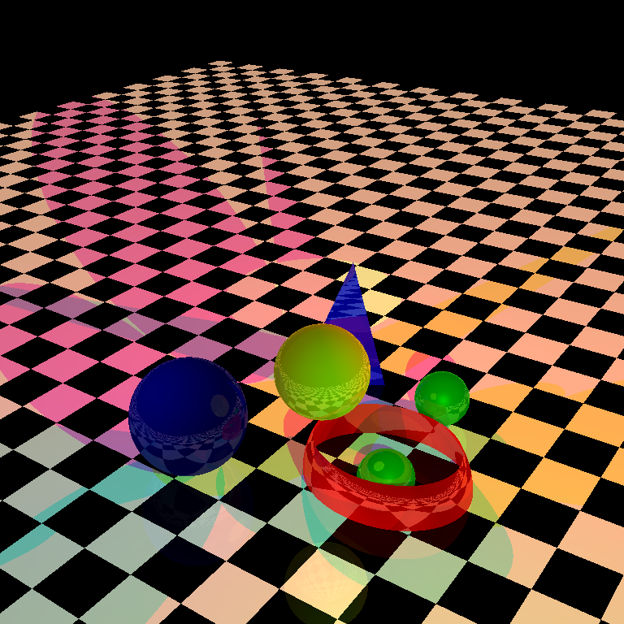
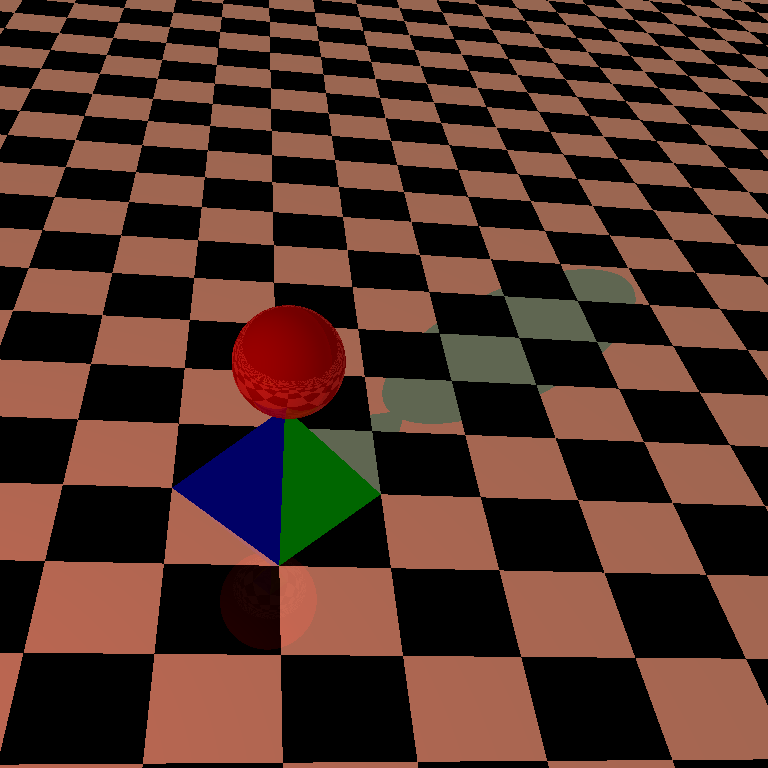

# Computer Graphics Sessional
---
This course particularly is very interesting, because I learned how displays render different types of objects, various shapes, sizes and colors. 
- The final offline is the most exciting one. Implementing **Ray Tracing** functionality to the objects. How light rays behave (reflect, refract) on the surface of different types of objects, the effect of light source positions, their luminescense, color and types. Also, got to learn different shading models that are actually used.
- Different types of mathematics that are powering the process of viewing objects on a grid of pixels (wizardcraftlike)
- Using mathematics, I moved a ball on a surface using keyboard controls, morphed shaped to and from sphere to double-pyramidial
- In the online, created a **Merry go round** within just one-hour!!

🖤 **Language used:** C++ \
🧰 **Library:** Bitmap

## Some samples

